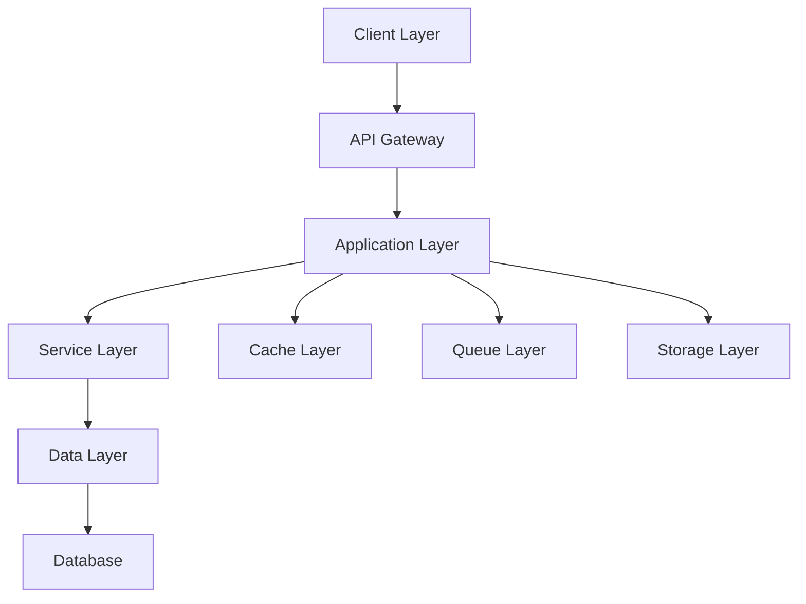
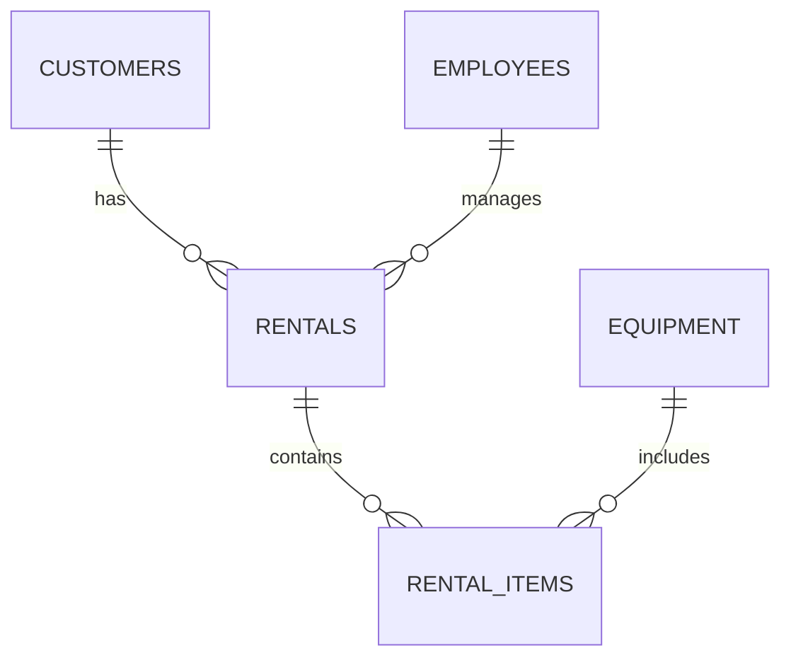
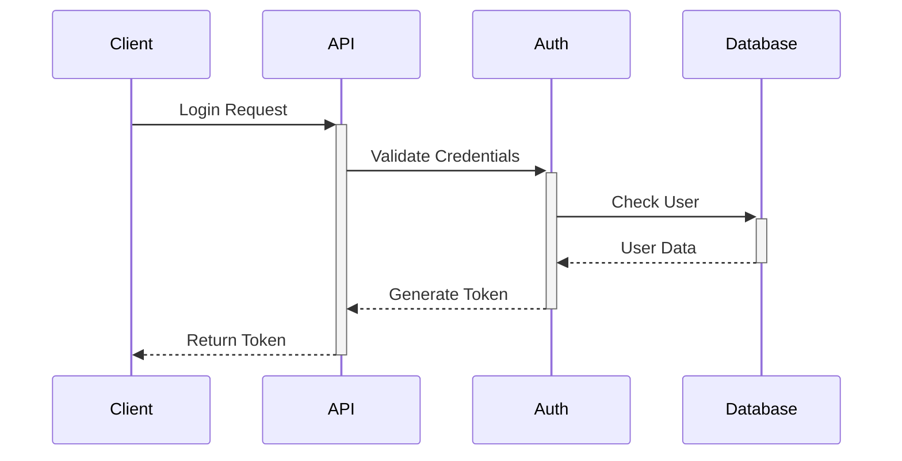

# Architecture Documentation - Laravel 12 Rental Management System

## Overview

This document describes the architecture of the Laravel 12 Rental Management System, including its components, design patterns, and technical decisions.

## Table of Contents

1. [System Architecture](#system-architecture)
2. [Module Architecture](#module-architecture)
3. [Database Architecture](#database-architecture)
4. [Frontend Architecture](#frontend-architecture)
5. [Security Architecture](#security-architecture)
6. [Integration Architecture](#integration-architecture)

## System Architecture

### High-Level Overview



### Component Layers

1. **Client Layer**
    - React SPA
    - Mobile Applications
    - Third-party Integrations
    - Admin Dashboard

2. **API Gateway**
    - Route Management
    - Authentication
    - Rate Limiting
    - Request Validation
    - Response Transformation

3. **Application Layer**
    - Module Controllers
    - Request Handlers
    - Response Formatters
    - Event Dispatchers
    - Job Dispatchers

4. **Service Layer**
    - Business Logic
    - Domain Services
    - External Services
    - Integration Services
    - Utility Services

5. **Data Layer**
    - Repositories
    - Models
    - Query Builders
    - Data Transformers
    - Cache Managers

### System Components

1. **Core Components**

    ```php
    app/
    ├── Http/
    │   ├── Controllers/
    │   ├── Middleware/
    │   └── Requests/
    ├── Services/
    │   ├── Auth/
    │   ├── Payment/
    │   └── Notification/
    ├── Models/
    ├── Events/
    └── Listeners/
    ```

2. **Module Components**
    ```php
    Modules/
    ├── RentalManagement/
    ├── EquipmentManagement/
    ├── CustomerManagement/
    └── EmployeeManagement/
    ```

## Module Architecture

### Module Structure

```php
ModuleName/
├── Config/
├── Console/
├── Database/
│   ├── Migrations/
│   ├── Seeders/
│   └── factories/
├── Http/
│   ├── Controllers/
│   ├── Middleware/
│   └── Requests/
├── Providers/
├── Resources/
│   ├── assets/
│   ├── lang/
│   └── views/
├── Routes/
│   ├── api.php
│   └── web.php
├── Services/
├── Repositories/
└── Tests/
```

### Design Patterns

1. **Repository Pattern**

    ```php
    interface RentalRepositoryInterface
    {
        public function find(int $id): ?Rental;
        public function create(array $data): Rental;
        public function update(Rental $rental, array $data): bool;
        public function delete(Rental $rental): bool;
    }

    class RentalRepository implements RentalRepositoryInterface
    {
        public function __construct(
            private readonly Rental $model
        ) {}

        public function find(int $id): ?Rental
        {
            return $this->model->find($id);
        }
    }
    ```

2. **Service Pattern**

    ```php
    class RentalService
    {
        public function __construct(
            private readonly RentalRepositoryInterface $repository,
            private readonly PaymentService $paymentService,
            private readonly NotificationService $notificationService
        ) {}

        public function createRental(array $data): Rental
        {
            // Business logic implementation
        }
    }
    ```

3. **Factory Pattern**
    ```php
    class RentalFactory
    {
        public static function create(string $type): RentalInterface
        {
            return match ($type) {
                'equipment' => new EquipmentRental(),
                'vehicle' => new VehicleRental(),
                default => throw new InvalidArgumentException(),
            };
        }
    }
    ```

### Event Architecture

1. **Event Classes**

    ```php
    class RentalCreated
    {
        public function __construct(
            public readonly Rental $rental
        ) {}
    }
    ```

2. **Listeners**
    ```php
    class SendRentalConfirmation
    {
        public function handle(RentalCreated $event): void
        {
            // Send confirmation logic
        }
    }
    ```

## Database Architecture

### Database Schema



### Table Structures

1. **Core Tables**

    ```sql
    CREATE TABLE customers (
        id BIGINT UNSIGNED AUTO_INCREMENT PRIMARY KEY,
        name VARCHAR(255) NOT NULL,
        email VARCHAR(255) UNIQUE NOT NULL,
        phone VARCHAR(20),
        created_at TIMESTAMP,
        updated_at TIMESTAMP,
        deleted_at TIMESTAMP NULL
    );

    CREATE TABLE rentals (
        id BIGINT UNSIGNED AUTO_INCREMENT PRIMARY KEY,
        customer_id BIGINT UNSIGNED NOT NULL,
        status VARCHAR(20) NOT NULL,
        start_date TIMESTAMP NOT NULL,
        end_date TIMESTAMP NOT NULL,
        total_amount DECIMAL(10,2) NOT NULL,
        FOREIGN KEY (customer_id) REFERENCES customers(id)
    );
    ```

2. **Relationship Tables**
    ```sql
    CREATE TABLE rental_items (
        id BIGINT UNSIGNED AUTO_INCREMENT PRIMARY KEY,
        rental_id BIGINT UNSIGNED NOT NULL,
        equipment_id BIGINT UNSIGNED NOT NULL,
        quantity INT NOT NULL,
        rate DECIMAL(10,2) NOT NULL,
        FOREIGN KEY (rental_id) REFERENCES rentals(id),
        FOREIGN KEY (equipment_id) REFERENCES equipment(id)
    );
    ```

### Database Optimization

1. **Indexing Strategy**

    ```sql
    -- Primary search fields
    CREATE INDEX idx_rentals_status ON rentals(status);
    CREATE INDEX idx_rentals_dates ON rentals(start_date, end_date);

    -- Foreign key indexes
    CREATE INDEX idx_rental_items_rental ON rental_items(rental_id);
    CREATE INDEX idx_rental_items_equipment ON rental_items(equipment_id);
    ```

2. **Query Optimization**

    ```php
    // Eager loading relationships
    $rentals = Rental::with(['customer', 'items.equipment'])
        ->where('status', 'active')
        ->get();

    // Using query builders
    $rentals = DB::table('rentals')
        ->join('customers', 'rentals.customer_id', '=', 'customers.id')
        ->select('rentals.*', 'customers.name')
        ->where('rentals.status', 'active')
        ->get();
    ```

## Frontend Architecture

### Component Architecture

1. **Component Structure**

    ```typescript
    // Base component interface
    interface BaseProps {
        className?: string;
        children?: React.ReactNode;
    }

    // Component implementation
    const RentalForm: React.FC<RentalFormProps> = ({ onSubmit, initialData }) => {
        // Component logic
    };
    ```

2. **State Management**

    ```typescript
    // Global state
    interface RentalState {
        rentals: Rental[];
        loading: boolean;
        error: Error | null;
    }

    // State slice
    const rentalSlice = createSlice({
        name: 'rentals',
        initialState,
        reducers: {
            // Reducers
        },
    });
    ```

### Component Organization

```typescript
src/
├── components/
│   ├── common/
│   │   ├── Button/
│   │   ├── Input/
│   │   └── Modal/
│   └── features/
│       ├── rental/
│       └── equipment/
├── hooks/
├── services/
├── store/
└── utils/
```

### Styling Architecture

1. **Tailwind Configuration**

    ```javascript
    // tailwind.config.js
    module.exports = {
        content: ['./resources/**/*.{js,ts,jsx,tsx}', './Modules/**/Resources/**/*.{js,ts,jsx,tsx}'],
        theme: {
            extend: {
                // Custom theme
            },
        },
        plugins: [require('@tailwindcss/forms'), require('@tailwindcss/typography')],
    };
    ```

2. **Component Styling**
    ```typescript
    const Button = styled.button`
        ${tw`px-4 py-2 bg-blue-500 text-white rounded-md`}
        &:hover {
            ${tw`bg-blue-600`}
        }
    `;
    ```

## Security Architecture

### Authentication Flow



### Authorization System

1. **Role-Based Access Control**

    ```php
    class RentalPolicy
    {
        public function view(User $user, Rental $rental): bool
        {
            return $user->hasRole('admin') ||
                   $user->id === $rental->customer_id;
        }

        public function create(User $user): bool
        {
            return $user->hasPermission('rentals.create');
        }
    }
    ```

2. **Permission System**

    ```php
    // Permission registration
    Gate::define('manage-rentals', function (User $user) {
        return $user->hasAnyRole(['admin', 'manager']);
    });

    // Usage in controllers
    public function update(Rental $rental)
    {
        $this->authorize('manage-rentals');
        // Update logic
    }
    ```

### Security Measures

1. **API Security**

    ```php
    // Rate limiting middleware
    Route::middleware(['auth:sanctum', 'throttle:60,1'])
        ->group(function () {
            Route::apiResource('rentals', RentalController::class);
        });
    ```

2. **Data Encryption**
    ```php
    class Customer extends Model
    {
        protected $casts = [
            'document_number' => 'encrypted',
            'tax_number' => 'encrypted',
        ];
    }
    ```

## Integration Architecture

### External Services

1. **Payment Integration**

    ```php
    interface PaymentGatewayInterface
    {
        public function processPayment(
            float $amount,
            string $currency,
            array $paymentMethod
        ): PaymentResult;
    }

    class StripeGateway implements PaymentGatewayInterface
    {
        public function processPayment(
            float $amount,
            string $currency,
            array $paymentMethod
        ): PaymentResult {
            // Stripe implementation
        }
    }
    ```

2. **Notification System**

    ```php
    class NotificationService
    {
        public function __construct(
            private readonly EmailService $emailService,
            private readonly SMSService $smsService,
            private readonly PushNotificationService $pushService
        ) {}

        public function sendNotification(
            User $user,
            string $type,
            array $data
        ): void {
            // Notification logic
        }
    }
    ```

### API Integration

1. **API Clients**

    ```php
    class WeatherAPIClient
    {
        public function __construct(
            private readonly HttpClient $client,
            private readonly string $apiKey
        ) {}

        public function getWeatherForecast(
            string $location
        ): WeatherForecast {
            // API call implementation
        }
    }
    ```

2. **Webhook Handlers**

    ```php
    class PaymentWebhookHandler
    {
        public function handle(Request $request): Response
        {
            $payload = $request->validate([
                'type' => 'required|string',
                'data' => 'required|array',
            ]);

            match ($payload['type']) {
                'payment.succeeded' => $this->handlePaymentSuccess($payload),
                'payment.failed' => $this->handlePaymentFailure($payload),
                default => throw new UnhandledWebhookException(),
            };
        }
    }
    ```

## Performance Optimization

### Caching Strategy

1. **Cache Configuration**

    ```php
    // Cache service provider
    public function register(): void
    {
        $this->app->singleton('cache', function ($app) {
            return new CacheManager($app);
        });
    }
    ```

2. **Cache Implementation**
    ```php
    class RentalService
    {
        public function getRental(int $id): Rental
        {
            return Cache::remember(
                "rental.{$id}",
                3600,
                fn () => $this->repository->find($id)
            );
        }
    }
    ```

### Queue System

1. **Job Processing**

    ```php
    class ProcessRentalReturn implements ShouldQueue
    {
        public function __construct(
            private readonly Rental $rental
        ) {}

        public function handle(): void
        {
            // Process rental return logic
        }
    }
    ```

2. **Queue Configuration**
    ```php
    // Queue configuration
    'connections' => [
        'redis' => [
            'driver' => 'redis',
            'connection' => 'default',
            'queue' => 'default',
            'retry_after' => 90,
            'block_for' => null,
        ],
    ]
    ```

## Deployment Architecture

### Infrastructure

1. **Server Configuration**

    ```nginx
    server {
        listen 80;
        server_name example.com;
        root /var/www/rental-system/public;

        location / {
            try_files $uri $uri/ /index.php?$query_string;
        }

        location ~ \.php$ {
            fastcgi_pass unix:/var/run/php/php8.2-fpm.sock;
            fastcgi_index index.php;
            include fastcgi_params;
        }
    }
    ```

2. **Docker Configuration**

    ```dockerfile
    # PHP Service
    FROM php:8.2-fpm

    # Install dependencies
    RUN apt-get update && apt-get install -y \
        libpng-dev \
        libjpeg-dev \
        libfreetype6-dev \
        zip \
        unzip

    # Configure PHP
    RUN docker-php-ext-configure gd --with-freetype --with-jpeg
    RUN docker-php-ext-install pdo pdo_mysql gd

    # Copy application
    COPY . /var/www/html/
    ```

### Monitoring

1. **Application Monitoring**

    ```php
    // Telescope configuration
    Telescope::filter(function (IncomingEntry $entry) {
        return $entry->isReportableException() ||
               $entry->isFailedRequest() ||
               $entry->isSlowQuery();
    });
    ```

2. **Error Tracking**
    ```php
    // Sentry integration
    class Handler extends ExceptionHandler
    {
        public function register(): void
        {
            $this->reportable(function (Throwable $e) {
                if (app()->bound('sentry')) {
                    app('sentry')->captureException($e);
                }
            });
        }
    }
    ```
